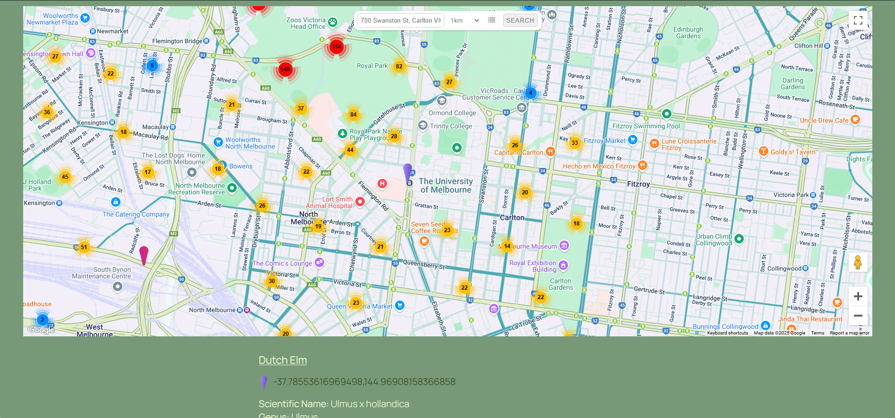
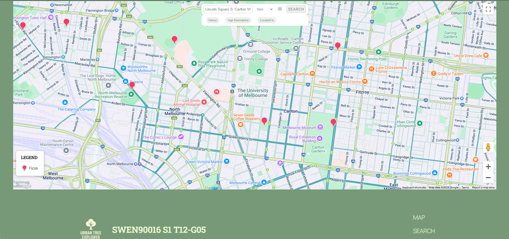
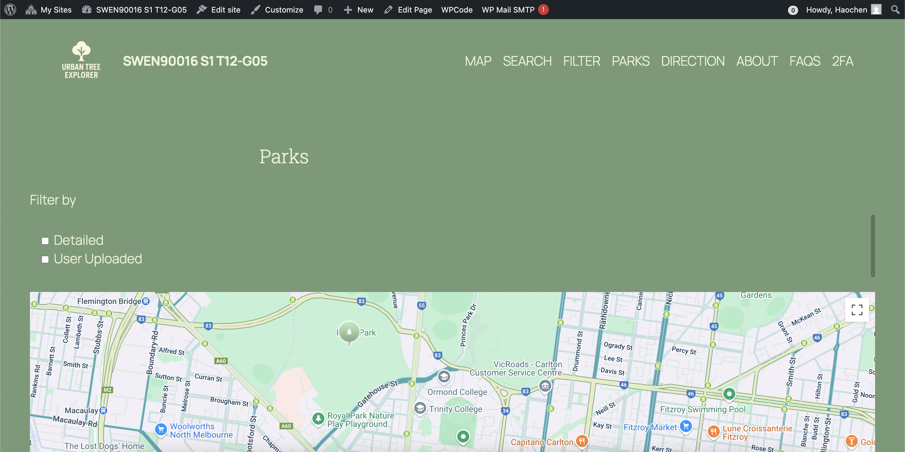
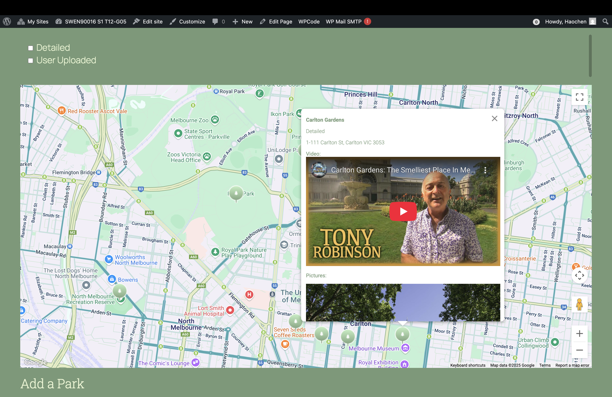
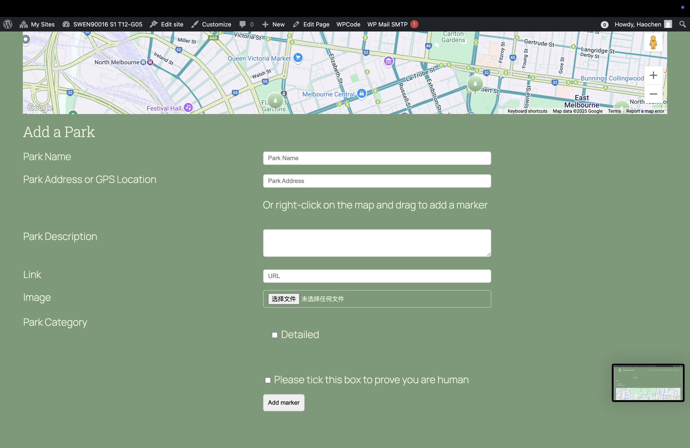
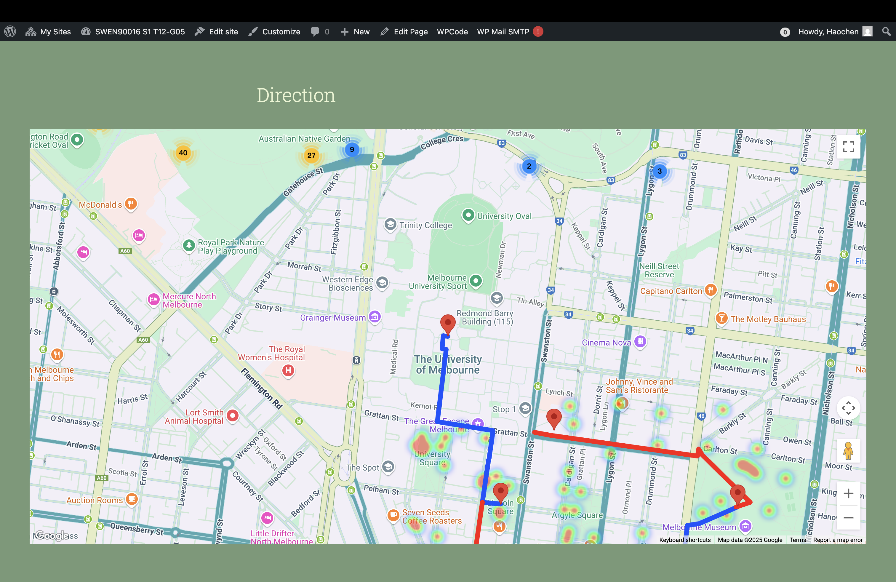

# Project Portfolio: Urban Tree Explorer

**Role:** Tech Lead / Full Stack Developer

**Developer:** Haochen Zhou (SkywingJam)

**Tech Stack:** WordPress, PHP, JavaScript, CSS, WP Go Map

**Grade:** High Distinction (83.75/100)

---

## Executive Summary

**Urban Tree Explorer** is a comprehensive web-based geospatial application designed to help students and researchers visualize urban forestry data, locate parks, and plan green walking routes in Melbourne.

As the **Lead Developer**, I took ownership of the core technical architecture, driving the project from initial setup to the delivery of complex interactive features. I moved beyond standard CMS configurations, utilizing **custom PHP, JavaScript, and CSS** to implement bespoke functionality that standard plugins could not offer.

---

## Key Technical Contributions

### 1. Advanced Interactive Mapping & Geolocation

* **Core Map Implementation:** Deployed and configured the primary interactive map engine using WP Go Map, handling thousands of data points for tree locations.
* **Search & Filtering Logic:** Engineered the logic for location-based searching (radius search) and category filtering (e.g., by tree genus or age), ensuring performant data retrieval.
* **Dynamic Legend (Custom JS):** Wrote custom **JavaScript** to create a dynamic map legend that updates in real-time based on the user's search context and active map layers, significantly improving usability.

### 2. Security & Access Control

* **Custom Middleware for Access Control:** Bypassed standard plugin limitations by writing **custom PHP** scripts to enforce strict login requirements. This ensured that sensitive research data was only accessible to authenticated users (University staff and students).
* **Two-Factor Authentication (2FA) System:** Successfully architected and implemented a TOTP-based 2FA system for user logins.
  * *Note:* Although this feature was eventually disabled to align with the standard project scope (as it was considered an advanced feature beyond the general cohort requirements), the implementation demonstrated advanced capability in handling secure authentication flows within the WordPress ecosystem.

### 3. Content Visualization & User Interaction

* **Park Visualization Module:** Developed a rich detail view for Melbourne parks. This involved:
  * Integrating multimedia content (image galleries and embedded YouTube videos) directly into map marker info-windows.
  * Structuring data to highlight key locations like University Square and Lincoln Square.
* **User-Generated Content (UGC):** Implemented functionality allowing users to contribute to the dataset by submitting new markers and descriptions, fostering a community-driven data approach.

### 4. UI/UX Design & Theming

* **Custom Theme Development:** Overhauled the default WordPress appearance using **custom CSS** to create a professional, academic-grade user interface.
* **Responsive Design:** Ensured the map interface and navigation were fully responsive across devices, optimizing the layout for both desktop research and on-the-go mobile usage.

---

## Project Gallery

### 1. Search & Filtering (Sprint 2)

*Demonstrating the location-based search and category filtering capabilities.*

*Figure 1: The custom search interface allowing users to define search radius and location.*

*Figure 2: Category filtering in action, refining the map dataset.*

### 2. Park Visualization (Sprint 3)

*Showcasing the rich media integration and detailed park views.*

*Figure 3: Interactive park markers on the map.*

*Figure 4: Detailed park information including embedded video content.*

*Figure 5: Interface for users to submit new park locations.*

### 3. Navigation & Itineraries

*Visualizing the walking paths and directions.*

*Figure 6: Directional routing with greenery density heatmap for the walking itinerary feature.*

### Demo (YouTube)

*(Note: This demo is narrated by a team member, showcasing the features I architected and implemented. Click on the image to view on YouTube)*

---

## Conclusion

This project demonstrates my ability to:

1. **Extend CMS capabilities** through custom coding (PHP/JS) rather than relying solely on off-the-shelf solutions.
2. **Manage end-to-end feature delivery**, from the initial map setup (Sprint 1) to complex data visualization (Sprint 3).
3. **Balance technical requirements** (security, performance) with **User Experience** (dynamic legends, responsive design).
